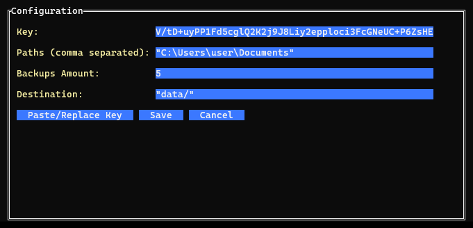

# BackupUSB

This is a simple project, meant to safely backup to an external drive one or multiple paths, recursively, in order for them to be restored later
This project is MEANT to rely on asyncronous encryption, in order to keep the backups (stored with the program to generate them) and the decryption key separately

---

## Commands

```txt
Usage: backup [help | config | decrypt]

  * backup help
     - Showes you this message

  * backup config
     - Lets you edit the program configuration

  * backup decrypt <file> [destination] [--tar]
     - Decrypts a previous backup file
     - You can also set the private key as an enviroment variable (PRIV_KEY) to avoid pausing
     - Please AVOID storing the key as a persistent value and only set it on each execution
```

#### No Args

> If a config is found (`config.bc`) this will simply start backing up the paths with the given config

#### Config (`backup config`)
> This will open an interactive config editor **in terminal**, since the config itself is stored in a statically encrypted format



#### Decrypt (`backup decrypt`)
> You can run this command to decrypt a given backup
> 
> The destination path refers to the path of the decrypted output. It defaults to `_[FILENAME]` for backups extracted to folders, and to `[FILENAME].tar` for backups only uncompressed, and still in a tar format
>
> Finally, you can specify the argument `--tar` either as the first or as the last argument, in order to only decompress the backup, and not extract it (as described above)

---

## Algorithms

  - Blake3: Used for the MacSum of the already encrypted file, in order to verify the file integrity before decrypting
  - Crystals Kyber K2SO: Used to generated and safely encrypt the whole header, key by key
  - AES256 CTR: Used to encrypt the main data block, using a random key generated on every execution
  - Tar: Used to generate a constant stream of data, archiving the files to backup (uncompressed)
  - Zstandard: Used to compress the already tarred file (compression level 5)

---

## How does it work

#### First run

> The program gets first executed, creates a default config, suggests a randomly generated key pair (the public key is added to config automatically) and the config editor is opened

#### Encryption

> Backups the exceed the backup amount get deleted (oldest first) | Set it to -1 to disable
>
> The file is created (`[DESTINATION]/[TIMESTAMP]`), and 64 bytes at the start are skipped for the macsum
>
> The pre-encrypted header is written to file, as well as the data itself, that gets encrypted as the same time as it's archived (in order to avoid any possible file recovery)
>
> The macsum of the rest of the file (both encrypted header AND data) is finally written at the start of the file

#### Decryption

> The MacSum is read, followed by the header
>
> MacSum of the encrypted header and data is calculated and compared to the MacSum found previously
>
> IF, and only if, it matches, continue with the extraction into a folder named with the backup timestamp

---

## Streams

In order to garantee everything to be done in memory, whilst working for very large file, the program in based on a series of read/write streams

#### Encryption

`File I/O` (Files) -> `Tar` -> `Zstandard` -> `AES Encrypt` -> `File I/O` (Backup) _AND_ `MAC`

#### Decryption

1) `File I/O` (Backup) -> `MAC`

2) `File I/O` (Backup) -> `AES Decrypt` -> `Zstandard` -> `UnTar` -> `File I/O` (Files)

---

## File Structure

`[MacSum]` | `[AesKey]` `[IV]` `[MacKey]` | `[Data]`

#### First Block (MacSum, Plain/Blake3)

  - **[MacSum]**: 64B - Blake3 of the already encrypted file, in order (both header and data)

#### Second Block (Header, Crystal)

  - **[AesKey]***: 1568B / 32B - Random key generated with Crystals Kyber
  - **[IV]***: 1568B / 16B - Random key generated with Crystals Kyber (NOTE: On decryption this returns 32B, we take the first 16 of those)
  - **[MacKey]***: 1568B / 32B - Random key generated with Crystals Kyber

*The keys in this block have a different size when encrypted and decrypted

#### Third Block

  - **[Data]**: AnySize / Same Size - AES256 CTR - This is the encrypted version of the tar, containing the files

